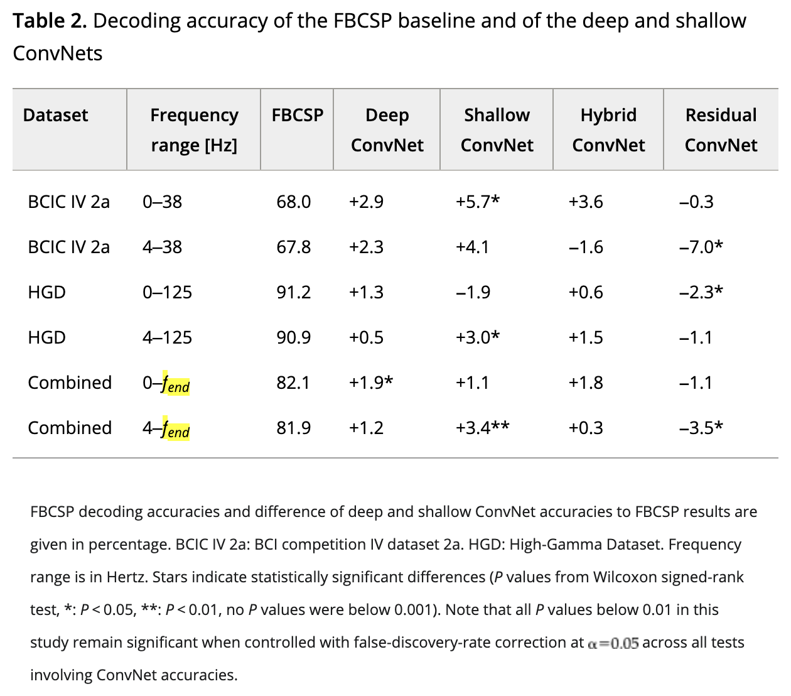

# CNN_for_EEG_reproducibility

## Instruction

Challenge 1: CNNs for EEG decoding and visualization 

Group: Seminars!! (student-organized) 

Paper: Schirrmeister, R. T., Springenberg, J. T., Fiederer, L. D. J., Glasstetter, M., Eggensperger, K., Tangermann, M., ... & Ball, T. (2017). Deep learning with convolutional neural networks for EEG decoding and visualization. Human brain mapping, 38(11), 5391-5420. 

Read the paper: https://onlinelibrary.wiley.com/doi/10.1002/hbm.23730 

Reproduce their evaluation results using the repo: https://github.com/NeuroTechX/moabb/tree/develop [Linjeskift til tekstombrydning]Follow this tutorial (check here: https://braindecode.org/stable/auto_examples/model_building/plot_regression.html#sphx-glr-auto-examples-model-building-plot-regression-py): https://braindecode.org/stable/auto_examples/model_building/plot_bcic_iv_2a_moabb_trial.html#sphx-glr-auto-examples-model-building-plot-bcic-iv-2a-moabb-trial-py 

Make sure to switch to Deep4Net classifier  

Reproduce the DeepConvNet results in Table 2 



Notes from TA 2025: 

✅  Which are the specific "evaluation results" from the paper to reproduce? The ones in table 2 

✅ In the first tutorial, pip installs work and the code runs. However, the outputs (e.g. the training curves) are not what's shared in the tutorial. 

✅ MOABB installs and getting started example works

## Report

https://www.overleaf.com/project/6ac8dcb8f771144562b4448a

## Reproduce Table 2 (Deep ConvNet)

Minimal cropped Deep4Net script (BCIC IV 2a first; HGD/combined left for later):

```bash
# smoke test (1 subject, few epochs)
python reproduce_table2_deepconvnet.py --subjects 3 --bands 4-38 --epochs 4

# closer to Table 2 for BCIC IV 2a (both bands, all 9 subjects)
python reproduce_table2_deepconvnet.py --subjects all --bands both --epochs 100
```

Target Deep ConvNet mean accuracies from Table 2:
- BCIC IV 2a, 0–38 Hz: 68.0 + 2.9 ≈ **70.9%**
- BCIC IV 2a, 4–38 Hz: 67.8 + 2.3 ≈ **70.1%**

## Plan

- [x] Run the tutorial notebook
- [x] Initial DeepConvNet Table 2 script (`reproduce_table2_deepconvnet.py`)
- [ ] What are all the links? why do we need the MOABB repo directly? What is the relevance of the "Convolutional neural network regression model on fake data"?
- [ ] What is the combined dataset?
- [ ] Figure out dataset loading using MOABB (BCIC IV 2a, HGD) -> both can be loaded through "braindecode.datasets.BNCI2014_001" and "braindecode.datasets.HGD" (code exists in the tutorial)
- [ ] Figure out frequency filtering on datasets from 0 or from 4 (code exists in the tutorial)
- [ ] Figure out the training procedure
- [ ] Train models and produce decoding accuracy
- [ ] Extend script to HGD + Combined rows of Table 2
- [ ] Write the report